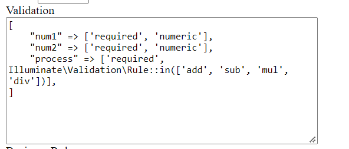
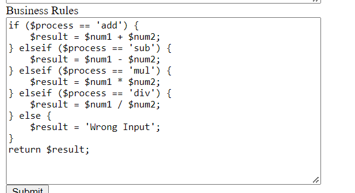

## Introduction

Decision Engine package for laravel. This package provide support for making decision engine in laravel version 9.

## Installation
Just install samsin33/laravel-decision-engine package with composer.

```bash
$ composer require samsin33/laravel-decision-engine
```

## Database Migration
Decision Engine service provider registers its own database migration directory, so remember to migrate your database after installing the package. The migrations will add 3 tables to your database:

```bash
$ php artisan migrate
```

If you need to overwrite the migrations that ship with this package, you can publish them using the vendor:publish Artisan command:

```bash
$ php artisan vendor:publish --tag="decision-engine-migrations"
```

If you would like to prevent Decision Engine's migrations from running entirely, you may use the ignoreMigrations method provided by Razorpay. Typically, this method should be called in the register method of your AppServiceProvider:

```bash
use Samsin33\DecisionEngine\DecisionEngine;

/**
 * Register any application services.
 *
 * @return void
 */
public function register()
{
    DecisionEngine::ignoreMigrations();
}
```

## Publish Config

If you need to overwrite the config file that ship with this package, you can publish them using the vendor:publish Artisan command:

```bash
$ php artisan vendor:publish --tag="decision-engine-config"
```

## Env Configuration

You can change your database connection for models, default will be your DB_CONNECTION if not then mysql. If you wish to change this you can specify a different connection in your .env file:

```bash
DECISION_ENGINE_CONNECTION=mysql
```

You can change your database primary key type for models, default is bigInt. If you wish to change this to uuid you can specify it in your .env file.

For now only ***bit integer*** and ***uuid*** is supported.

```bash
DECISION_ENGINE_PRIMARY_KEY_TYPE=uuid
```

## Publish Views

You need to overwrite the view files that ship with this package and can change according to your design, you can publish them using the vendor:publish Artisan command:

```bash
$ php artisan vendor:publish --tag="decision-engine-views"
```

## Showing and Creating Rule Engine

For index page and create page of Rule Engine goto routes

```bash
/decision-engine/rule-engines
/decision-engine/rule-engines/create
```

You can add these routes to your menu to access them. All the required routes are already registered.

## Rule Engine Types

For now this package supports only 2 types of Rule Engine.
1. Code - Set of code will be executed which u will put in business rules column on the basis of the input you provide.
2. Command - A command will be executed which u will put in business rules column on the basis of the input you provide.

## Route Guards

Your web routes are contained inside web_guards.
Your api routes are contained inside api_guards.
You can change them in config files.

## Example - Making a calculator

As an example lets a make a calculator.

Create a rule engine:

**Name** - Calculator

**Type** - Code

**Validation** - This should be an array of validation rules of your input. E.g.

You can also make your own validations and use.

**Business Rules** - This should be the code which runs when the validation will pass.


**Status** - It should be active for rule execution.

Your business rules should always return a value to show an output.

For a command example.
Make a command Calculator with:

**signature** - calc {num1} {num2} {process}

and in the Business Rules field should be:

**Business Rules** - calc $num1 $num2 $process

the output of command type has 2 attributes
result and info

**result** - returns integer from command.

**info** - save the output of the command, i.e. anything printed in line, info, comment, question, warn, and error methods.

## Executing Business Rules on input

To execute business rules you need to call the api.

```bash
URL: /decision-engine/rule-executions

Headers: {
  "accept": "application/json",
  "content-type": "application/json"
}
# Other headers attributes depends on your api guards.

Request:
{
    "rule_execution": {
        "rule_engine_id": 1,
        "input": {
            "num1": 45,
            "num2": 6,
            "process": "add"
        }
    }
}

Response:
{
    "output": {
        "status": "Code Success",
        "output": {
            "add": 51
        }
    },
    "rule_execution": {
        "rule_engine_id": 1,
        "input": {
            "num1": 45,
            "num2": 6,
            "process": "add"
        },
        "id": 1,
        "status": "Code Success",
        "updated_at": "2022-11-20T16:10:59.000000Z",
        "created_at": "2022-11-20T16:10:58.000000Z",
        "output": "{\"add\":51}"
    }
}
```

**Note**
1. Input should be associative array.
2. Your input keys will be converted to variables in the business rules value.
